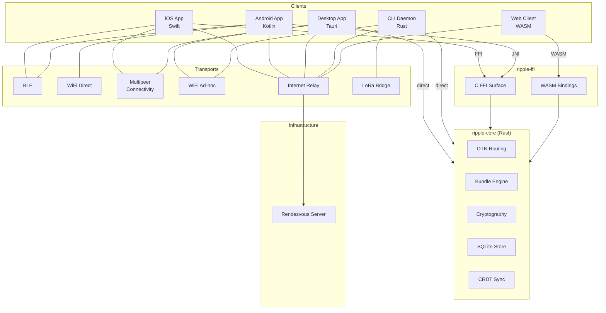
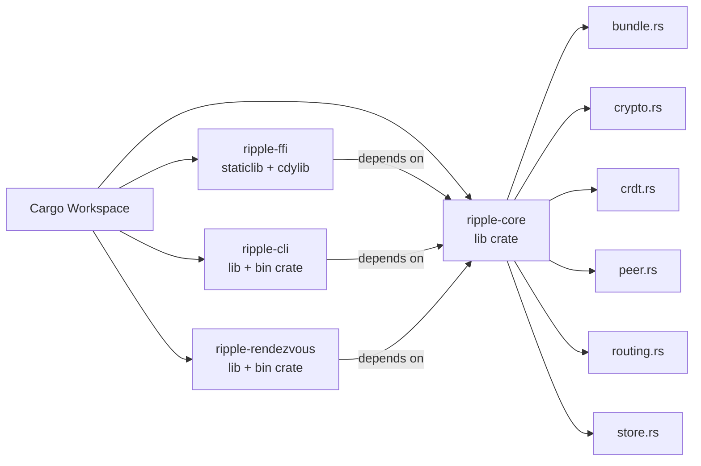
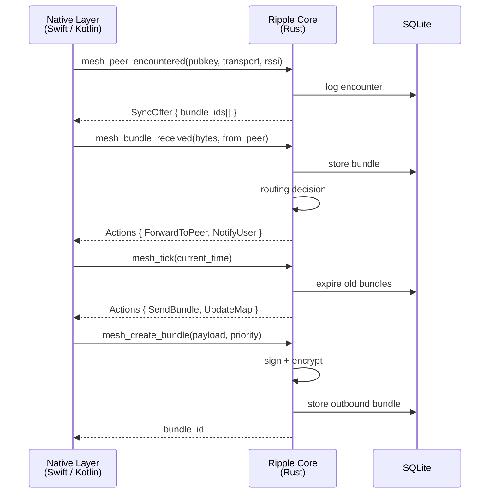
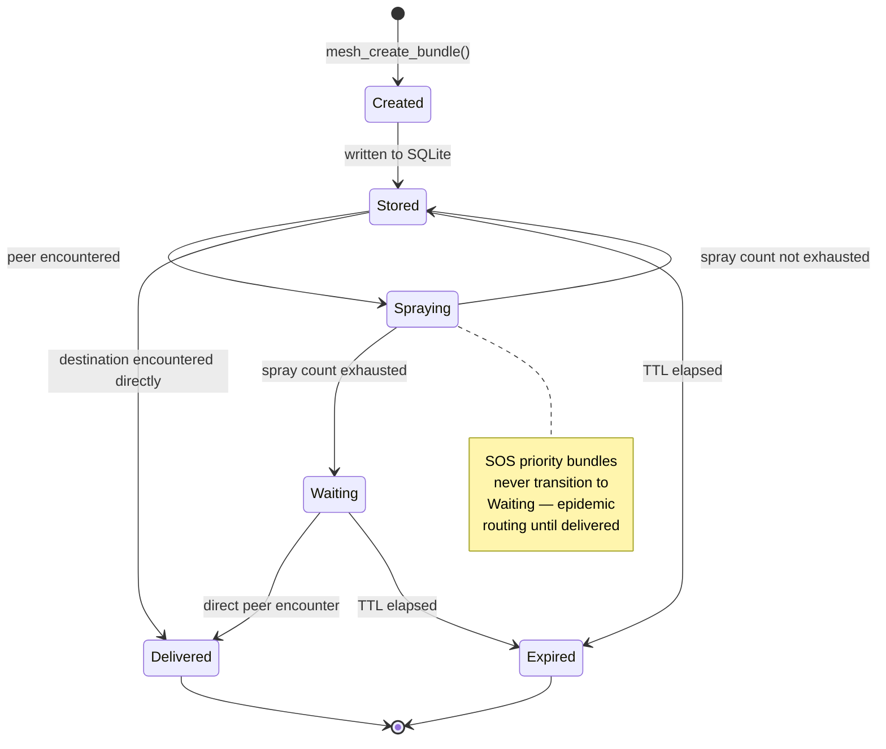
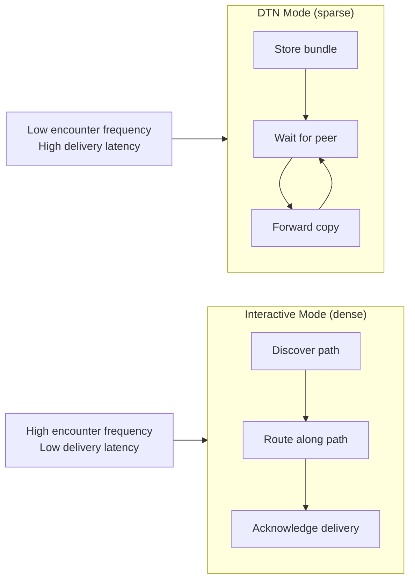
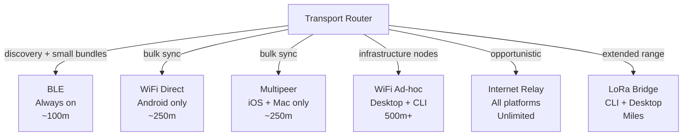
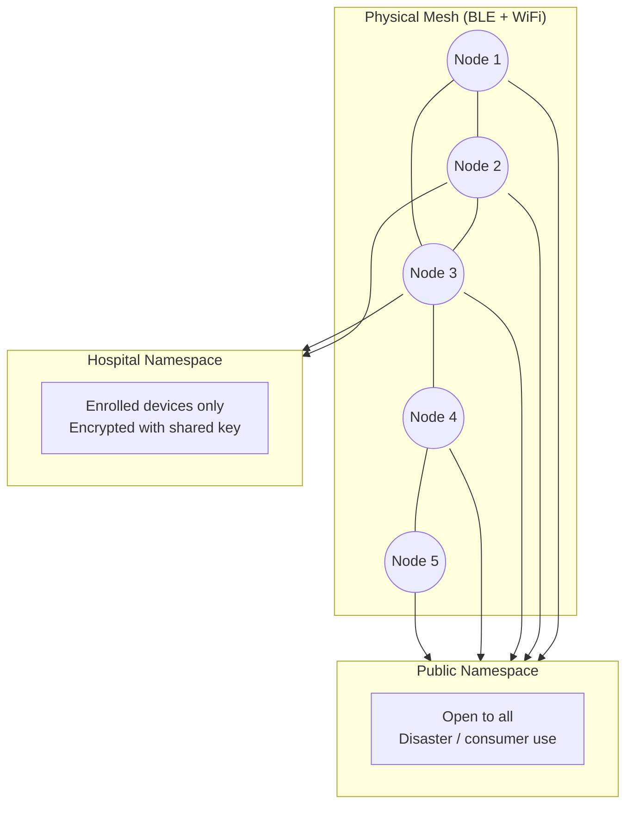
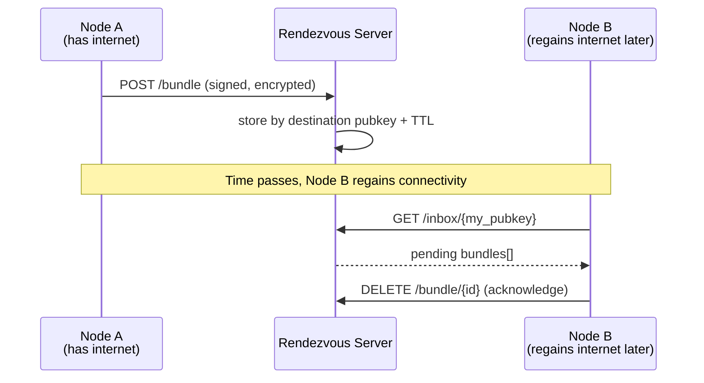
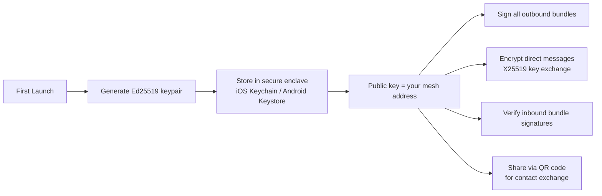

# System Overview

Ripple is organized as a protocol core surrounded by platform-specific client
shells. The Rust core contains all mesh logic. Platform shells handle hardware
access, UI, and background lifecycle.

## High Level Architecture



## Cargo Workspace Structure



## Platform and FFI Boundary

The Rust core is a pure logic library. It has no knowledge of BLE, UI, or platform
APIs. Native platform code observes physical events and delegates all decisions to
the core.



## Bundle Lifecycle



## Mesh Routing Modes

The routing layer operates in two modes selected automatically based on observed
network density:



## Transport Layer

Each transport implements the same `MeshTransport` trait. The routing layer
selects transports per peer based on availability and capability.



## Mesh Namespace Model

Ripple supports multiple isolated mesh namespaces on the same physical network.
Devices can participate in multiple namespaces simultaneously.



## Rendezvous Server

The rendezvous server is optional infrastructure that improves delivery rates
when any mesh node has internet connectivity. It is intentionally simple and
has no visibility into message content.



## Key Management

Every Ripple identity is an Ed25519 keypair generated locally on first launch.
Private keys never leave the device.


````

